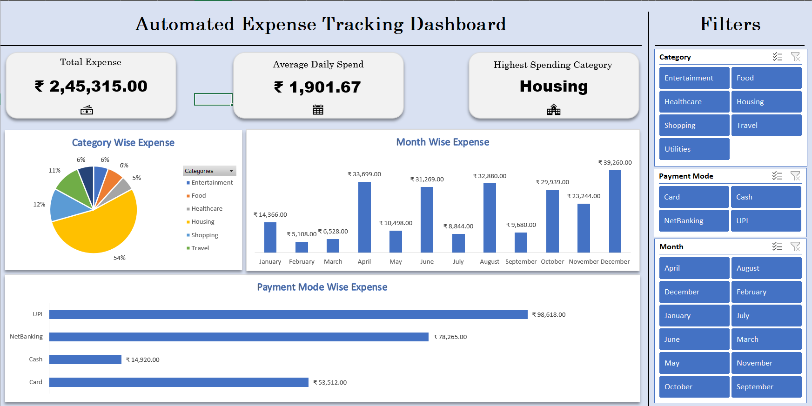

# 📊 Automated Expense Tracker Dashboard (Excel)

## 📌 Project Overview
This project is an interactive Excel-based Expense Tracker designed to automate personal expense analysis and improve productivity.  
It converts raw transaction data into a dynamic dashboard with KPIs and charts for better financial insights.

## 🎯 Objectives
- Track expenses by category, month, and payment mode
- Reduce manual calculation effort
- Provide clear visual insights using an interactive dashboard

## 🛠 Tools & Features
- Microsoft Excel  
- Tables (structured data)  
- Data Validation (dropdown lists)  
- SUMIFS formulas for aggregation  
- PivotTables & PivotCharts  
- Slicers for interactivity  
- KPI Cards (Total Expense, Average Daily Spend, Highest Spending Category)

## 📷 Dashboard Preview

## 📊 Dashboard Components
- Total Expense KPI  
- Average Daily Spend KPI  
- Highest Spending Category KPI  
- Category-wise Expense Pie Chart  
- Month-wise Expense Column Chart  
- Payment Mode-wise Expense Bar Chart  
- Slicers for Month, Category, and Payment Mode

## ⚙️ How to Use
1. Open the Excel file from the `dashboard` folder  
2. Add new expense records in the Raw_Data sheet  
3. Use slicers to filter by Month, Category, or Payment Mode  
4. Dashboard updates automatically

## 🧠 Key Learning
- Structured data modeling in Excel  
- Automation using formulas instead of manual calculations  
- Building interactive dashboards for analysis  
- Applying productivity-focused design principles

## 🚀 Future Improvements
- Budget vs Actual comparison  
- Year-wise analysis  
- Automatic data import (CSV)  
- Power BI version of the dashboard

---

### 👤 Author
Souptik  
(Data Analyst | Excel | Dashboarding)

